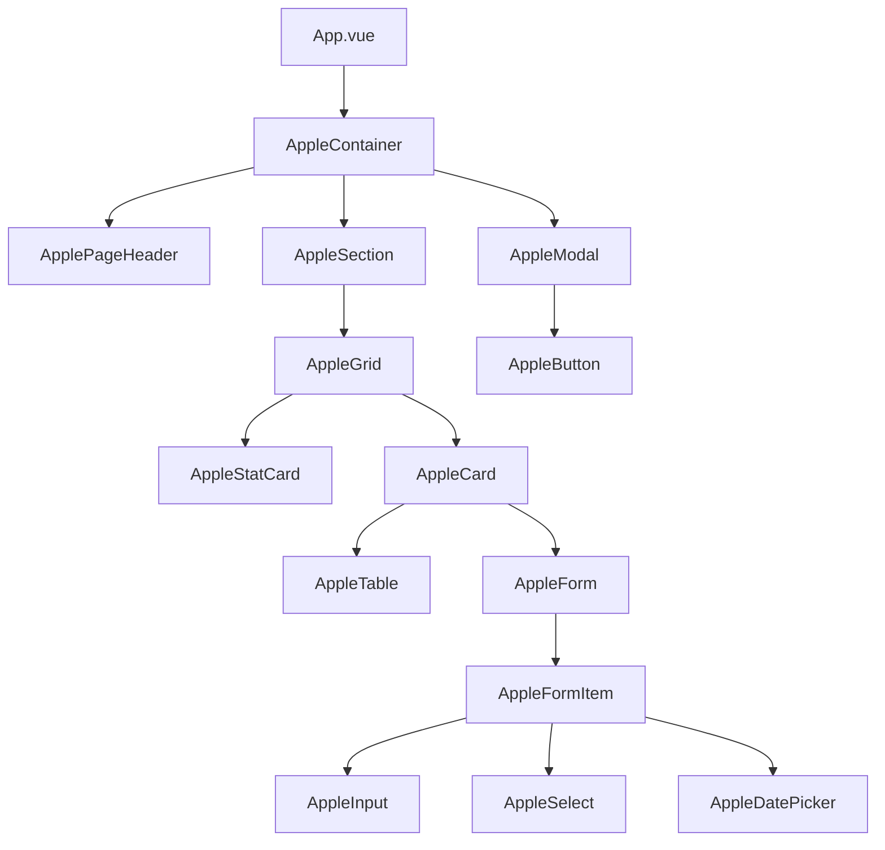

# Plan de Implementación: Apple Design System en RRHHMOD

## 📋 Resumen Ejecutivo

Este documento detalla la estrategia completa para implementar el Apple Design System en todas las vistas del proyecto RRHHMOD, migrando desde Naive UI hacia los componentes Apple personalizados ya creados.

---

## 🎯 Objetivos

1. **Consistencia Visual**: Aplicar el diseño Apple en todas las vistas del sistema
2. **Mejora de UX**: Implementar interacciones fluidas y animaciones sutiles
3. **Mantenibilidad**: Reducir dependencias de librerías externas
4. **Performance**: Optimizar el rendimiento con componentes ligeros

---

## 📊 Análisis del Estado Actual

### ✅ Componentes Apple Existentes (50 componentes)

#### Layout & Estructura
- `AppleContainer` - Contenedor principal
- `AppleGrid` - Sistema de grillas
- `ApplePageHeader` - Encabezado de página
- `AppleSection` - Secciones de contenido
- `AppleDivider` - Divisores

#### Cards
- `AppleCard` - Card base con variantes
- `AppleCardHeader` - Encabezado de card
- `AppleCardSection` - Sección de card
- `AppleStatCard` - Card de estadísticas
- `AppleEmptyState` - Estado vacío

#### Botones
- `AppleButton` - Botón principal con variantes
- `AppleButtonGroup` - Grupo de botones
- `AppleIconButton` - Botón de icono
- `AppleFabButton` - Botón flotante

#### Formularios
- `AppleInput` - Input de texto
- `AppleSearchInput` - Input de búsqueda
- `AppleSelect` - Select/dropdown
- `AppleDatePicker` - Selector de fecha
- `AppleSwitch` - Switch/toggle
- `AppleCheckbox` - Checkbox
- `AppleFormItem` - Item de formulario

#### Datos
- `AppleTable` - Tabla de datos
- `AppleList` - Lista
- `AppleListItem` - Item de lista
- `AppleAvatar` - Avatar
- `AppleUserItem` - Item de usuario
- `AppleStatusIndicator` - Indicador de estado

#### Navegación
- `AppleTabs` - Pestañas
- `AppleBreadcrumb` - Breadcrumb
- `AppleTimeline` - Línea de tiempo

#### Feedback
- `AppleBadge` - Badge/insignia
- `AppleTag` - Etiqueta
- `AppleAlert` - Alerta
- `AppleModal` - Modal
- `AppleDrawer` - Drawer lateral
- `AppleSkeleton` - Skeleton loader
- `AppleLoading` - Loading spinner

### 🎨 Sistema de Diseño Implementado

**Variables CSS** ([`apple-design.css`](frontend/src/assets/styles/apple-design.css)):
```css
/* Colores Apple */
--apple-gray-100 a --apple-gray-700
--apple-blue, --apple-green, --apple-orange, --apple-red, etc.

/* Espaciado (4px grid) */
--space-1 (4px) a --space-12 (48px)

/* Bordes redondeados */
--radius-sm (6px) a --radius-xl (20px)

/* Tipografía SF Pro */
--font-stack: -apple-system, BlinkMacSystemFont, 'SF Pro Display'
```

### ❌ Vistas que Usan Naive UI (Necesitan Migración)

#### Módulo de Empleados
- [`employees/index.vue`](frontend/src/views/employees/index.vue) - Usa `n-button`, `n-card`, `n-data-table`

#### Módulo de Contratos
- [`contracts/index.vue`](frontend/src/views/contracts/index.vue) - Usa `n-statistic`, `n-card`, `n-data-table`
- [`contracts/Onboarding.vue`](frontend/src/views/contracts/Onboarding.vue) - Usa `n-steps`, `n-card`

#### Módulo de Nómina (Payroll)
- [`payroll/index.vue`](frontend/src/views/payroll/index.vue)
- [`payroll/PayrollRun.vue`](frontend/src/views/payroll/PayrollRun.vue)
- [`payroll/PayrollList.vue`](frontend/src/views/payroll/PayrollList.vue)
- [`payroll/PayslipsList.vue`](frontend/src/views/payroll/PayslipsList.vue)
- [`payroll/BenefitsList.vue`](frontend/src/views/payroll/BenefitsList.vue)
- [`payroll/discounts/index.vue`](frontend/src/views/payroll/discounts/index.vue)
- [`payroll/loans/index.vue`](frontend/src/views/payroll/loans/index.vue)
- [`payroll/liquidations/index.vue`](frontend/src/views/payroll/liquidations/index.vue)

#### Módulo de Tiempo (Time)
- [`time/index.vue`](frontend/src/views/time/index.vue)
- [`time/AttendanceList.vue`](frontend/src/views/time/AttendanceList.vue)
- [`time/OvertimeList.vue`](frontend/src/views/time/OvertimeList.vue)
- [`time/OvertimeImport.vue`](frontend/src/views/time/OvertimeImport.vue)
- [`time/OvertimeReview.vue`](frontend/src/views/time/OvertimeReview.vue)
- [`time/OvertimeSettings.vue`](frontend/src/views/time/OvertimeSettings.vue)
- [`time/VacationsList.vue`](frontend/src/views/time/VacationsList.vue)
- [`time/PermitsList.vue`](frontend/src/views/time/PermitsList.vue)

#### Módulo de Personal
- [`personal/index.vue`](frontend/src/views/personal/index.vue)
- [`personal/PersonalList.vue`](frontend/src/views/personal/PersonalList.vue)
- [`personal/ContractsList.vue`](frontend/src/views/personal/ContractsList.vue)
- [`personal/DesvinculacionList.vue`](frontend/src/views/personal/DesvinculacionList.vue)
- [`personal/LiquidacionesList.vue`](frontend/src/views/personal/LiquidacionesList.vue)
- [`personal/DocumentosList.vue`](frontend/src/views/personal/DocumentosList.vue)
- [`personal/PlantillasDocumentos.vue`](frontend/src/views/personal/PlantillasDocumentos.vue)

#### Módulos Legales y Fiscales
- [`legal/afp/index.vue`](frontend/src/views/legal/afp/index.vue)
- [`legal/essalud/index.vue`](frontend/src/views/legal/essalud/index.vue)
- [`legal/concepts/index.vue`](frontend/src/views/legal/concepts/index.vue)
- [`legal/regimens/index.vue`](frontend/src/views/legal/regimens/index.vue)
- [`legal/templates/index.vue`](frontend/src/views/legal/templates/index.vue)
- [`tax/sunat/index.vue`](frontend/src/views/tax/sunat/index.vue)
- [`tax/mintra/index.vue`](frontend/src/views/tax/mintra/index.vue)

#### Configuración y Reportes
- [`settings/index.vue`](frontend/src/views/settings/index.vue)
- [`reports/index.vue`](frontend/src/views/reports/index.vue)

#### Administración
- [`admin/Companies.vue`](frontend/src/views/admin/Companies.vue)
- [`admin/audit/index.vue`](frontend/src/views/admin/audit/index.vue)

**Total: ~40 vistas que necesitan migración**

---

## 🔄 Estrategia de Migración

### Fase 1: Componentes Faltantes

Crear componentes Apple adicionales necesarios:

#### 1. `AppleSteps.vue` (Para Onboarding)
```vue
<AppleSteps :current="2" :items="[
  { title: 'Datos Personales', icon: PersonOutline },
  { title: 'Contrato', icon: DocumentTextOutline },
  { title: 'Documentos', icon: FolderOutline }
]" />
```

#### 2. `AppleStatistic.vue` (Para métricas)
```vue
<AppleStatistic 
  label="Total Empleados" 
  :value="150" 
  prefix="👥"
  trend="up"
  :trend-value="12"
/>
```

#### 3. `AppleUpload.vue` (Para carga de archivos)
```vue
<AppleUpload 
  accept=".xlsx,.xls"
  :max-size="5"
  @change="handleFileChange"
>
  <template #trigger>
    <AppleButton :icon="CloudUploadOutline">
      Cargar Excel
    </AppleButton>
  </template>
</AppleUpload>
```

#### 4. `AppleCollapse.vue` (Para secciones colapsables)
```vue
<AppleCollapse>
  <AppleCollapseItem title="Ingresos" name="ingresos">
    <ContenidoIngresos />
  </AppleCollapseItem>
</AppleCollapse>
```

#### 5. `AppleDescriptions.vue` (Para detalles)
```vue
<AppleDescriptions :columns="2">
  <AppleDescriptionsItem label="Nombre">Juan Pérez</AppleDescriptionsItem>
  <AppleDescriptionsItem label="DNI">12345678</AppleDescriptionsItem>
</AppleDescriptions>
```

#### 6. `AppleProgress.vue` (Para barras de progreso)
```vue
<AppleProgress :percentage="75" color="blue" />
```

#### 7. `AppleRadio.vue` y `AppleRadioGroup.vue`
```vue
<AppleRadioGroup v-model="selected">
  <AppleRadio value="option1">Opción 1</AppleRadio>
  <AppleRadio value="option2">Opción 2</AppleRadio>
</AppleRadioGroup>
```

#### 8. `AppleInputNumber.vue`
```vue
<AppleInputNumber 
  v-model="cantidad" 
  :min="0" 
  :max="100"
  :step="1"
/>
```

#### 9. `AppleTextarea.vue`
```vue
<AppleTextarea 
  v-model="comentario"
  placeholder="Ingrese comentario"
  :rows="4"
/>
```

#### 10. `AppleSpace.vue` (Para espaciado)
```vue
<AppleSpace :gap="16" direction="horizontal">
  <AppleButton>Cancelar</AppleButton>
  <AppleButton variant="primary">Guardar</AppleButton>
</AppleSpace>
```

### Fase 2: Tabla de Equivalencias

| Naive UI | Apple Component | Notas |
|----------|----------------|-------|
| `n-button` | `AppleButton` | Variantes: primary, secondary, ghost, danger, success |
| `n-card` | `AppleCard` | Props: title, subtitle, hoverable, hoverLift |
| `n-data-table` | `AppleTable` | Props: columns, data, loading, pagination |
| `n-input` | `AppleInput` | Props: placeholder, disabled, clearable |
| `n-select` | `AppleSelect` | Props: options, placeholder, multiple |
| `n-date-picker` | `AppleDatePicker` | Props: type (date, daterange), format |
| `n-modal` | `AppleModal` | Props: show, title, width |
| `n-tag` | `AppleTag` | Props: color, closable, size |
| `n-badge` | `AppleBadge` | Props: value, color, dot |
| `n-switch` | `AppleSwitch` | Props: checked, disabled |
| `n-checkbox` | `AppleCheckbox` | Props: checked, label |
| `n-tabs` | `AppleTabs` | Props: activeKey, items |
| `n-alert` | `AppleAlert` | Props: type, title, description |
| `n-divider` | `AppleDivider` | Props: orientation, dashed |
| `n-space` | `AppleSpace` | Props: gap, direction, align |
| `n-grid` | `AppleGrid` | Props: columns, gap |
| `n-icon` | Usar directamente iconos de `@vicons/ionicons5` |
| `n-statistic` | `AppleStatistic` | **Crear nuevo** |
| `n-steps` | `AppleSteps` | **Crear nuevo** |
| `n-upload` | `AppleUpload` | **Crear nuevo** |
| `n-collapse` | `AppleCollapse` | **Crear nuevo** |
| `n-descriptions` | `AppleDescriptions` | **Crear nuevo** |
| `n-progress` | `AppleProgress` | **Crear nuevo** |
| `n-input-number` | `AppleInputNumber` | **Crear nuevo** |
| `n-radio` | `AppleRadio` | **Crear nuevo** |

### Fase 3: Patrones de Migración

#### Patrón 1: Vista con Tabla Simple

**Antes (Naive UI):**
```vue
<template>
  <div class="page-container">
    <div class="header-actions">
      <h1>Gestión de Personal</h1>
      <n-button type="primary" @click="handleNew">
        <template #icon><n-icon><AddOutline /></n-icon></template>
        Nuevo
      </n-button>
    </div>
    
    <n-card :bordered="false">
      <n-data-table
        :columns="columns"
        :data="data"
        :loading="loading"
      />
    </n-card>
  </div>
</template>
```

**Después (Apple):**
```vue
<template>
  <AppleContainer>
    <ApplePageHeader
      title="Gestión de Personal"
      subtitle="Directorio de colaboradores activos"
    >
      <template #actions>
        <AppleButton :icon="AddOutline" @click="handleNew">
          Nuevo
        </AppleButton>
      </template>
    </ApplePageHeader>
    
    <AppleCard>
      <AppleTable
        :columns="columns"
        :data="data"
        :loading="loading"
      />
    </AppleCard>
  </AppleContainer>
</template>
```

#### Patrón 2: Vista con Estadísticas

**Antes (Naive UI):**
```vue
<n-grid :cols="4" :x-gap="16">
  <n-gi>
    <n-card>
      <n-statistic label="Total" :value="150" />
    </n-card>
  </n-gi>
</n-grid>
```

**Después (Apple):**
```vue
<AppleGrid :columns="4">
  <AppleStatCard
    :icon="Users"
    :value="150"
    label="Total Empleados"
    color="blue"
  />
</AppleGrid>
```

#### Patrón 3: Formulario Modal

**Antes (Naive UI):**
```vue
<n-modal v-model:show="showModal" title="Nuevo Registro">
  <n-form :model="formData">
    <n-form-item label="Nombre">
      <n-input v-model:value="formData.nombre" />
    </n-form-item>
  </n-form>
  <template #action>
    <n-button @click="showModal = false">Cancelar</n-button>
    <n-button type="primary" @click="handleSave">Guardar</n-button>
  </template>
</n-modal>
```

**Después (Apple):**
```vue
<AppleModal v-model:show="showModal" title="Nuevo Registro">
  <AppleFormItem label="Nombre">
    <AppleInput v-model="formData.nombre" />
  </AppleFormItem>
  
  <template #footer>
    <AppleSpace justify="end">
      <AppleButton variant="secondary" @click="showModal = false">
        Cancelar
      </AppleButton>
      <AppleButton @click="handleSave">
        Guardar
      </AppleButton>
    </AppleSpace>
  </template>
</AppleModal>
```

#### Patrón 4: Tabs con Contenido

**Antes (Naive UI):**
```vue
<n-tabs v-model:value="activeTab">
  <n-tab-pane name="tab1" tab="Pestaña 1">
    <n-card>Contenido 1</n-card>
  </n-tab-pane>
  <n-tab-pane name="tab2" tab="Pestaña 2">
    <n-card>Contenido 2</n-card>
  </n-tab-pane>
</n-tabs>
```

**Después (Apple):**
```vue
<AppleTabs v-model="activeTab" :items="[
  { key: 'tab1', label: 'Pestaña 1' },
  { key: 'tab2', label: 'Pestaña 2' }
]">
  <template #tab1>
    <AppleCard>Contenido 1</AppleCard>
  </template>
  <template #tab2>
    <AppleCard>Contenido 2</AppleCard>
  </template>
</AppleTabs>
```

---

## 📝 Plan de Implementación por Módulos

### Módulo 1: Dashboard ✅ (Ya implementado)
- [`Dashboard.vue`](frontend/src/views/Dashboard.vue) - Ya usa componentes Apple

### Módulo 2: Empleados (Employees)
**Archivos:**
- [`employees/index.vue`](frontend/src/views/employees/index.vue)

**Cambios:**
1. Reemplazar `n-button` → `AppleButton`
2. Reemplazar `n-card` → `AppleCard`
3. Reemplazar `n-data-table` → `AppleTable`
4. Agregar `ApplePageHeader`
5. Envolver en `AppleContainer`

### Módulo 3: Contratos (Contracts)
**Archivos:**
- [`contracts/index.vue`](frontend/src/views/contracts/index.vue)
- [`contracts/Onboarding.vue`](frontend/src/views/contracts/Onboarding.vue)

**Cambios:**
1. Crear `AppleSteps` para el wizard de onboarding
2. Reemplazar `n-statistic` → `AppleStatCard`
3. Migrar formularios a componentes Apple
4. Actualizar navegación entre pasos

### Módulo 4: Nómina (Payroll) - PRIORIDAD ALTA
**Archivos (8 vistas):**
- `payroll/index.vue`
- `payroll/PayrollRun.vue`
- `payroll/PayrollList.vue`
- `payroll/PayslipsList.vue`
- `payroll/BenefitsList.vue`
- `payroll/discounts/index.vue`
- `payroll/loans/index.vue`
- `payroll/liquidations/index.vue`

**Componentes necesarios:**
- `AppleStatistic` para métricas
- `AppleDescriptions` para detalles de boletas
- `AppleCollapse` para secciones de conceptos
- `AppleProgress` para estados de procesamiento

### Módulo 5: Tiempo (Time/Overtime) - PRIORIDAD ALTA
**Archivos (8 vistas):**
- `time/index.vue`
- `time/AttendanceList.vue`
- `time/OvertimeList.vue`
- `time/OvertimeImport.vue`
- `time/OvertimeReview.vue`
- `time/OvertimeSettings.vue`
- `time/VacationsList.vue`
- `time/PermitsList.vue`

**Componentes necesarios:**
- `AppleUpload` para importación de Excel
- `AppleInputNumber` para configuración de horas
- `AppleCheckbox` para selección múltiple

### Módulo 6: Personal
**Archivos (7 vistas):**
- `personal/index.vue`
- `personal/PersonalList.vue`
- `personal/ContractsList.vue`
- `personal/DesvinculacionList.vue`
- `personal/LiquidacionesList.vue`
- `personal/DocumentosList.vue`
- `personal/PlantillasDocumentos.vue`

### Módulo 7: Legal y Fiscal
**Archivos (7 vistas):**
- `legal/afp/index.vue`
- `legal/essalud/index.vue`
- `legal/concepts/index.vue`
- `legal/regimens/index.vue`
- `legal/templates/index.vue`
- `tax/sunat/index.vue`
- `tax/mintra/index.vue`

### Módulo 8: Configuración y Reportes
**Archivos (2 vistas):**
- `settings/index.vue`
- `reports/index.vue`

### Módulo 9: Administración
**Archivos (2 vistas):**
- `admin/Companies.vue`
- `admin/audit/index.vue`

### Módulo 10: Layout Principal
**Archivos:**
- [`App.vue`](frontend/src/App.vue)

**Cambios:**
1. Mantener estructura de `n-layout` (es funcional)
2. Aplicar clases CSS de Apple Design
3. Mejorar sidebar con estilos Apple
4. Actualizar header con componentes Apple

---

## 🎨 Guía de Estilos y Mejores Prácticas

### 1. Espaciado Consistente
```vue
<!-- Usar variables de espaciado -->
<div style="padding: var(--space-6)">
  <AppleGrid :columns="3" gap="lg">
    <!-- Contenido -->
  </AppleGrid>
</div>
```

### 2. Colores Semánticos
```vue
<!-- Usar colores del sistema Apple -->
<AppleButton variant="primary">Azul (#007AFF)</AppleButton>
<AppleButton variant="success">Verde (#34C759)</AppleButton>
<AppleButton variant="danger">Rojo (#FF3B30)</AppleButton>
```

### 3. Tipografía
```vue
<!-- Usar clases de tipografía Apple -->
<h1 class="text-display">Título Principal</h1>
<h2 class="text-title">Título Sección</h2>
<p class="text-body">Texto normal</p>
<span class="text-caption">Texto pequeño</span>
```

### 4. Animaciones Sutiles
```css
/* Transiciones suaves */
transition: all 0.2s cubic-bezier(0.4, 0, 0.2, 1);

/* Hover con elevación */
.apple-card:hover {
  transform: translateY(-2px);
  box-shadow: var(--shadow-md);
}
```

### 5. Iconografía
```vue
<!-- Usar Ionicons 5 -->
<script setup>
import { 
  AddOutline, 
  PersonOutline, 
  DocumentTextOutline 
} from '@vicons/ionicons5'
</script>

<AppleButton :icon="AddOutline">Nuevo</AppleButton>
```

---

## 🔧 Componentes Nuevos a Crear

### 1. AppleSteps.vue
```vue
<template>
  <div class="apple-steps">
    <div 
      v-for="(step, index) in items" 
      :key="index"
      class="apple-step"
      :class="{ 
        'active': index === current,
        'completed': index < current 
      }"
    >
      <div class="apple-step-icon">
        <n-icon v-if="index < current" :component="CheckmarkCircle" />
        <n-icon v-else :component="step.icon" />
      </div>
      <div class="apple-step-content">
        <div class="apple-step-title">{{ step.title }}</div>
        <div v-if="step.description" class="apple-step-description">
          {{ step.description }}
        </div>
      </div>
    </div>
  </div>
</template>

<style scoped>
.apple-steps {
  display: flex;
  gap: var(--space-4);
}

.apple-step {
  flex: 1;
  display: flex;
  align-items: center;
  gap: var(--space-3);
  padding: var(--space-4);
  border-radius: var(--radius-lg);
  background: var(--bg-secondary);
  transition: all 0.2s ease;
}

.apple-step.active {
  background: var(--apple-blue);
  color: white;
}

.apple-step.completed {
  background: var(--apple-green);
  color: white;
}
</style>
```

### 2. AppleStatistic.vue
```vue
<template>
  <div class="apple-statistic">
    <div v-if="prefix" class="apple-statistic-prefix">{{ prefix }}</div>
    <div class="apple-statistic-value">{{ formattedValue }}</div>
    <div class="apple-statistic-label">{{ label }}</div>
    <div v-if="trend" class="apple-statistic-trend" :class="`trend-${trend}`">
      <n-icon :component="trend === 'up' ? ArrowUp : ArrowDown" />
      {{ trendValue }}%
    </div>
  </div>
</template>

<style scoped>
.apple-statistic {
  display: flex;
  flex-direction: column;
  gap: var(--space-2);
}

.apple-statistic-value {
  font-size: 2rem;
  font-weight: 700;
  letter-spacing: -0.03em;
  color: var(--text-primary);
}

.apple-statistic-label {
  font-size: 0.875rem;
  color: var(--text-secondary);
}

.apple-statistic-trend {
  display: flex;
  align-items: center;
  gap: var(--space-1);
  font-size: 0.8125rem;
  font-weight: 600;
}

.trend-up {
  color: var(--apple-green);
}

.trend-down {
  color: var(--apple-red);
}
</style>
```

### 3. AppleUpload.vue
```vue
<template>
  <div class="apple-upload">
    <input
      ref="fileInput"
      type="file"
      :accept="accept"
      :multiple="multiple"
      @change="handleChange"
      style="display: none"
    />
    
    <div 
      class="apple-upload-dragger"
      :class="{ 'dragging': isDragging }"
      @click="triggerUpload"
      @dragover.prevent="isDragging = true"
      @dragleave="isDragging = false"
      @drop.prevent="handleDrop"
    >
      <slot name="trigger">
        <div class="apple-upload-content">
          <n-icon :component="CloudUploadOutline" size="48" />
          <div class="apple-upload-text">
            Arrastra archivos aquí o haz clic para seleccionar
          </div>
          <div v-if="accept" class="apple-upload-hint">
            Formatos aceptados: {{ accept }}
          </div>
        </div>
      </slot>
    </div>
    
    <div v-if="fileList.length > 0" class="apple-upload-list">
      <div 
        v-for="(file, index) in fileList" 
        :key="index"
        class="apple-upload-item"
      >
        <n-icon :component="DocumentOutline" />
        <span class="apple-upload-filename">{{ file.name }}</span>
        <span class="apple-upload-size">{{ formatSize(file.size) }}</span>
        <AppleIconButton 
          :icon="CloseOutline" 
          size="small"
          @click="removeFile(index)"
        />
      </div>
    </div>
  </div>
</template>

<style scoped>
.apple-upload-dragger {
  border: 2px dashed var(--border-color);
  border-radius: var(--radius-lg);
  padding: var(--space-8);
  text-align: center;
  cursor: pointer;
  transition: all 0.2s ease;
}

.apple-upload-dragger:hover,
.apple-upload-dragger.dragging {
  border-color: var(--apple-blue);
  background: rgba(0, 122, 255, 0.05);
}

.apple-upload-content {
  display: flex;
  flex-direction: column;
  align-items: center;
  gap: var(--space-3);
}

.apple-upload-text {
  font-size: 1rem;
  font-weight: 500;
  color: var(--text-primary);
}

.apple-upload-hint {
  font-size: 0.875rem;
  color: var(--text-secondary);
}

.apple-upload-list {
  margin-top: var(--space-4);
  display: flex;
  flex-direction: column;
  gap: var(--space-2);
}

.apple-upload-item {
  display: flex;
  align-items: center;
  gap: var(--space-3);
  padding: var(--space-3);
  background: var(--bg-secondary);
  border-radius: var(--radius-md);
}

.apple-upload-filename {
  flex: 1;
  font-size: 0.875rem;
  color: var(--text-primary);
}

.apple-upload-size {
  font-size: 0.8125rem;
  color: var(--text-secondary);
}
</style>
```

---

## 📐 Arquitectura de Componentes



---

## 🚀 Orden de Implementación Recomendado

### Sprint 1: Componentes Base (1 semana)
1. ✅ Revisar componentes Apple existentes
2. Crear `AppleSteps`
3. Crear `AppleStatistic`
4. Crear `AppleUpload`
5. Crear `AppleCollapse`
6. Crear `AppleDescriptions`
7. Crear `AppleProgress`
8. Crear `AppleInputNumber`
9. Crear `AppleRadio` y `AppleRadioGroup`
10. Crear `AppleTextarea`
11. Crear `AppleSpace`

### Sprint 2: Vistas Principales (1 semana)
1. Migrar `employees/index.vue`
2. Migrar `contracts/index.vue`
3. Migrar `contracts/Onboarding.vue`
4. Actualizar `App.vue` con estilos Apple

### Sprint 3: Módulo de Nómina (1.5 semanas)
1. Migrar `payroll/index.vue`
2. Migrar `payroll/PayrollRun.vue`
3. Migrar `payroll/PayrollList.vue`
4. Migrar `payroll/PayslipsList.vue`
5. Migrar `payroll/BenefitsList.vue`
6. Migrar `payroll/discounts/index.vue`
7. Migrar `payroll/loans/index.vue`
8. Migrar `payroll/liquidations/index.vue`

### Sprint 4: Módulo de Tiempo (1.5 semanas)
1. Migrar `time/index.vue`
2. Migrar `time/AttendanceList.vue`
3. Migrar `time/OvertimeList.vue`
4. Migrar `time/OvertimeImport.vue`
5. Migrar `time/OvertimeReview.vue`
6. Migrar `time/OvertimeSettings.vue`
7. Migrar `time/VacationsList.vue`
8. Migrar `time/PermitsList.vue`

### Sprint 5: Módulo de Personal (1 semana)
1. Migrar todas las vistas de `personal/`

### Sprint 6: Módulos Legales y Fiscales (1 semana)
1. Migrar vistas de `legal/`
2. Migrar vistas de `tax/`

### Sprint 7: Configuración y Admin (0.5 semanas)
1. Migrar `settings/index.vue`
2. Migrar `reports/index.vue`
3. Migrar vistas de `admin/`

### Sprint 8: Testing y Refinamiento (1 semana)
1. Testing de todas las vistas migradas
2. Ajustes de diseño y UX
3. Optimización de performance
4. Documentación final

**Tiempo total estimado: 7-8 semanas**

---

## ✅ Checklist de Migración por Vista

Para cada vista, seguir este checklist:

- [ ] Reemplazar imports de Naive UI por componentes Apple
- [ ] Actualizar estructura HTML con componentes Apple
- [ ] Migrar estilos inline a clases CSS de Apple
- [ ] Actualizar eventos y props según API de componentes Apple
- [ ] Verificar responsive design
- [ ] Probar interacciones (hover, click, focus)
- [ ] Validar accesibilidad (ARIA labels, keyboard navigation)
- [ ] Testing en diferentes navegadores
- [ ] Documentar cambios específicos

---

## 📚 Recursos y Referencias

### Documentación
- [Apple Human Interface Guidelines](https://developer.apple.com/design/human-interface-guidelines/)
- [SF Pro Font](https://developer.apple.com/fonts/)
- [Ionicons 5](https://ionic.io/ionicons)

### Archivos Clave del Proyecto
- [`apple-design.css`](frontend/src/assets/styles/apple-design.css) - Sistema de diseño
- [`components/apple/index.ts`](frontend/src/components/apple/index.ts) - Exports de componentes
- [`Dashboard.vue`](frontend/src/views/Dashboard.vue) - Ejemplo de implementación

### Paleta de Colores Apple
```css
/* Azul Apple */
--apple-blue: #007AFF
--apple-blue-hover: #0051D5

/* Verde Apple */
--apple-green: #34C759

/* Naranja Apple */
--apple-orange: #FF9500

/* Rojo Apple */
--apple-red: #FF3B30

/* Grises Apple */
--apple-gray-100: #F5F5F7
--apple-gray-200: #E8E8ED
--apple-gray-300: #D2D2D7
--apple-gray-400: #86868B
--apple-gray-500: #6E6E73
--apple-gray-600: #424245
--apple-gray-700: #1D1D1F
```

---

## 🎯 Métricas de Éxito

1. **Consistencia Visual**: 100% de vistas usando componentes Apple
2. **Performance**: Reducción del 20% en bundle size al eliminar Naive UI
3. **Mantenibilidad**: Código más limpio y fácil de mantener
4. **UX**: Mejora en la percepción de calidad del diseño
5. **Accesibilidad**: Cumplimiento de estándares WCAG 2.1 AA

---

## 🔄 Proceso de Revisión

Cada vista migrada debe pasar por:

1. **Code Review**: Verificar calidad del código
2. **Design Review**: Verificar consistencia visual
3. **UX Review**: Verificar interacciones y flujos
4. **Testing**: Pruebas funcionales y de regresión
5. **Documentation**: Actualizar documentación

---

## 📝 Notas Adicionales

### Consideraciones Importantes

1. **Mantener Funcionalidad**: La migración es visual, no debe romper funcionalidad existente
2. **Backward Compatibility**: Mantener compatibilidad con código existente durante la transición
3. **Progressive Enhancement**: Migrar módulo por módulo, no todo de una vez
4. **Testing Continuo**: Probar cada cambio antes de continuar
5. **Documentar Decisiones**: Documentar cualquier desviación del plan

### Riesgos y Mitigación

| Riesgo | Probabilidad | Impacto | Mitigación |
|--------|--------------|---------|------------|
| Componentes faltantes | Media | Alto | Crear componentes antes de migrar |
| Regresiones funcionales | Media | Alto | Testing exhaustivo por módulo |
| Inconsistencias visuales | Baja | Medio | Design review en cada sprint |
| Tiempo de desarrollo | Media | Medio | Priorizar módulos críticos |

---

## 🎉 Conclusión

Este plan proporciona una ruta clara para implementar el Apple Design System en todo el proyecto RRHHMOD. La migración se realizará de forma incremental, priorizando los módulos más críticos y asegurando la calidad en cada paso.

**Próximos Pasos:**
1. Revisar y aprobar este plan
2. Crear los componentes faltantes (Sprint 1)
3. Comenzar migración de vistas principales (Sprint 2)
4. Continuar con módulos según prioridad

---

**Fecha de Creación**: 2026-02-06  
**Versión**: 1.0  
**Autor**: Kilo Code (Architect Mode)
